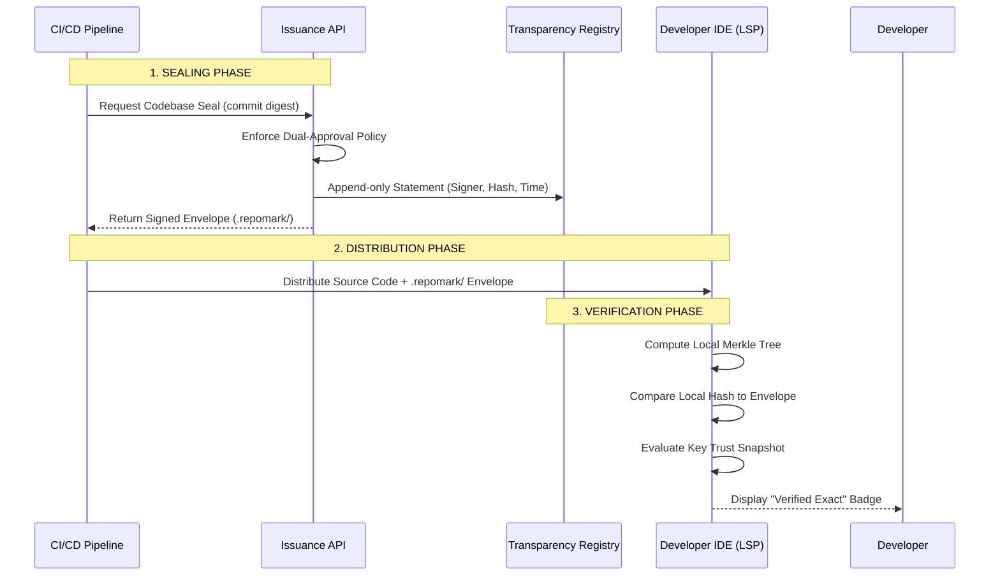

# 🛡️ RepoMark

**RepoMark** is an enterprise-grade cryptographic provenance and leak-tracing framework for source code. It allows organizations to cryptographically "seal" codebases, ensuring that origin, authenticity, and policy compliance can be verified entirely offline by developers and IDEs.

With RepoMark, you can instantly tell if a file was legitimately issued by your organization, if it has been tampered with, or if the underlying trust policy (such as a revoked signing key) has changed.

---

## ✨ Features

- **Offline Verification Engine:** Deterministic verification of signed Merkle trees with zero network calls.
- **Structural Watermarking:** Research-grade, compiler-validated watermarking for TypeScript code that survives copy-pasting and formatting changes.
- **Portable File Capsules:** Embed cryptographic signatures directly into single files, allowing them to be verified even when detached from the repository manifest.
- **Cross-IDE Language Server (LSP):** A centralized `repomarkd` daemon that provides real-time verification badges (CodeLens) and cryptographic evidence (Hover) to any editor (VS Code, NeoVim, IntelliJ).
- **Dual-Approval Governance:** An API-driven issuance pipeline that enforces multi-party approval before highly sensitive codebase attestation.

---

## 🏗️ Architecture

RepoMark operates in three distinct phases: **Sealing**, **Distribution**, and **Verification**.



---

## 📦 Packages & Workspace

RepoMark is a monorepo containing the following components:

| Package | Description |
| :--- | :--- |
| **`@repomark/core`** | The deterministic hashing, Merkle tree generation, and offline verification engine. |
| **`@repomark/cli`** | Command-line interface for sealing, packing, and verifying archives locally or in CI. |
| **`@repomark/lsp`** | Transport-agnostic Language Server (`repomarkd`) providing CodeLens and Hover evidence. |
| **`repomark-vscode`** | A thin VS Code client that connects to the LSP daemon for in-editor badges. |
| **`@repomark/issuance`** | HTTP service for enforcing governance, dual-approvals, and personalized fingerprinting. |
| **`@repomark/registry`** | Append-only SQLite external record store for tracking valid and revoked issuances. |
| **`@repomark/watermark-typescript`** | AST-based structural watermarking utilities for TypeScript code. |

---

## 🚀 Getting Started

### Prerequisites
- **Node.js:** v22 or higher
- **npm:** v10 or higher

### Building the Project
Clone the repository and build all workspaces:

```bash
git clone https://github.com/anaslari23/RepoMark.git
cd RepoMark
npm install
npm run build --workspaces
```

### Sealing a Codebase (CLI)
You can cryptographically seal a directory using the CLI (mock signer for local development):

```bash
export REPOMARK_ALLOW_MOCK_SIGNER=true
npx repomark seal --dir ./my-project --signer kms-mock --issuer-name "My Org" --claim verified-origin
```
This will generate a `.repomark/` folder containing the Merkle tree (`statement.json`), the signatures (`envelope.json`), and the local trust snapshot (`trust.json`).

### Running the IDE Extension
1. Open the project in VS Code.
2. Press `F5` to launch the **Extension Development Host**.
3. Open any sealed directory in the new window.
4. You will immediately see **✓ Verified origin** CodeLens badges at the top of your files!

---

## 🛡️ GitHub Actions Integration

RepoMark is designed to run in your CI pipelines to enforce safety checks across your organization. We recommend setting up a **Reusable Workflow** combined with a **GitHub Ruleset** to mandate that the `repomark verify` check passes on all Pull Requests before they can be merged.

For instructions on deploying the organization-wide safety check, see the internal `.github` deployment guidelines.

---

## ⚖️ License
Internal Proprietary Use.
